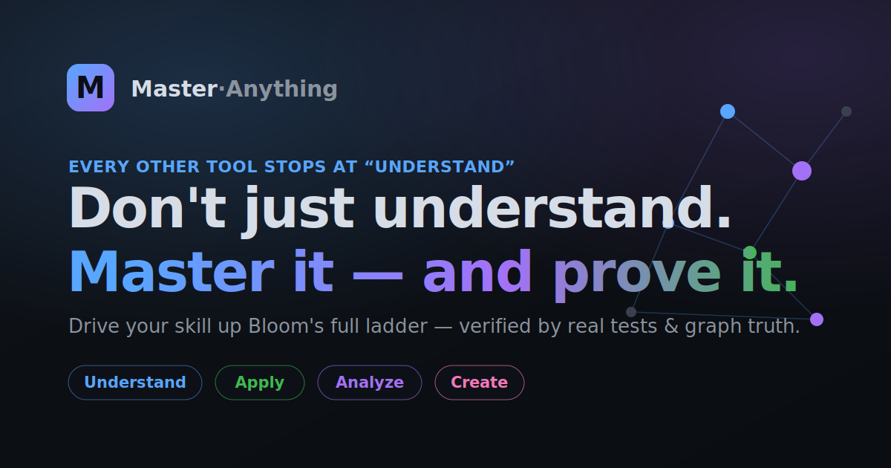
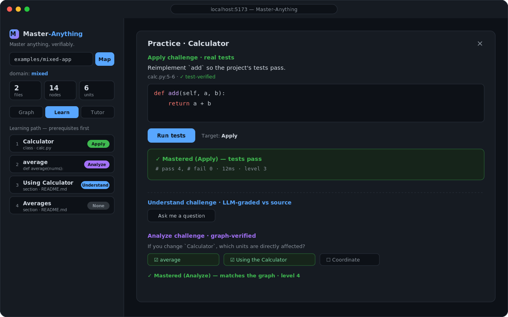

<div align="center">



# Master-Anything

**Master anything, verifiably.** — go beyond *understanding* a codebase to *mastering* it, and prove it.

[](./LICENSE)
[](https://nodejs.org)
[](https://www.typescriptlang.org/)
[](https://pnpm.io)

[**Website**](https://everettjf.github.io/Master-Anything/) · [Vision](./docs/VISION.md) · [Architecture](./docs/ARCHITECTURE.md)

</div>

Master-Anything turns **any body of knowledge** — code first, then docs, papers, web pages, PDFs — into an interactive
**knowledge graph**, and layers a **mastery engine** on top. It doesn't just explain things to you; it builds a
learning path, quizzes you, and — wherever possible — **verifies** that you've actually mastered each piece using
**real test execution** and **graph ground-truth**, not an LLM's opinion.

> Tools that *understand* a codebase give you a one-time map. Master-Anything tracks *your* mastery as a living
> state and pushes it up Bloom's ladder — Understand → Apply → Analyze — with objective checks at each step.

<div align="center">
  
  <br /><sub>The <b>Learn</b> tab — practice a unit; real tests and the graph verify your mastery.</sub>
</div>

---

## Why Master-Anything?

|                | Understand-style tools         | **Master-Anything**                                   |
| -------------- | ------------------------------ | ----------------------------------------------------- |
| Goal           | Read & comprehend (view-only)  | **Practice to competence** (a mastery state)          |
| Output         | A graph / dashboard            | Adaptive learning path **+ verifiable mastery**       |
| Verification   | —                              | **Real tests** (Apply) and **graph truth** (Analyze)  |
| Scope          | Usually one domain (code)      | **Anything** via pluggable adapters                   |
| Data moat      | The content graph              | The content graph **+ each learner's mastery graph**  |

The core insight: **a domain is just an input; once it's a knowledge graph, "how to make someone master it" is the
same engine.** That's why Master-Anything supports code *and* documents with one mastery engine and swappable adapters.

## Features

- 🧠 **Verifiable mastery** — the differentiator:
  - **Apply** — we blank a real function; you reimplement it; the project's **actual test suite** decides if you passed
    (Python · JavaScript · TypeScript).
  - **Analyze** — "if you change `X`, what's affected?" graded against the **call/dependency graph** (objective truth).
  - **Understand** — the tutor asks a question; an LLM grades your answer **against the source**.
- 🗺️ **Knowledge graph** — deterministic structure via [Tree-sitter](https://tree-sitter.github.io/), semantics via an LLM.
- 🧩 **Anything, via adapters** — code (Python/JS/TS), Markdown, HTML, PDF; **mixed repos merge into one graph** with
  **cross-domain edges** linking docs to the code they describe.
- 💬 **Graph-grounded tutor (GraphRAG)** — answers cite `path:line`, with **multi-turn memory** and optional
  embedding retrieval.
- 🧭 **Adaptive learning path** — units ordered by dependency; mastery tracked per `(learner, unit)`.
- 🔌 **Pluggable & degrades gracefully** — LLM via the [Vercel AI SDK](https://ai-sdk.dev) (OpenAI / Anthropic / Google /
  any OpenAI-compatible endpoint); test sandbox local or Docker; **runs with no API key** (heuristic fallback).
- 💾 **Persistent & incremental** — SQLite-backed; only changed files are re-enriched; a shareable graph artifact lets
  teammates skip the pipeline.

## How it works

```
┌──────────────────────────────────────────────────────────────┐
│  Interaction   Tutor (GraphRAG) · guided path · quizzes · tasks │  generic
├──────────────────────────────────────────────────────────────┤
│  Mastery engine   decompose · knowledge-trace (Bloom) ·        │  generic ★
│                   adaptive path · assess · verify              │
├──────────────────────────────────────────────────────────────┤
│  Universal knowledge graph   nodes (concept/symbol/section) +  │  generic
│                              edges (calls/contains/documents…) │
├──────────────────────────────────────────────────────────────┤
│  Domain adapters (pluggable)                                   │  per-domain
│   📦 Code (tree-sitter)   📄 Markdown/HTML   📑 PDF             │
└──────────────────────────────────────────────────────────────┘
```

The top three layers are **domain-agnostic** — adding a domain means writing one adapter. See
[`docs/ARCHITECTURE.md`](./docs/ARCHITECTURE.md) and [`docs/VISION.md`](./docs/VISION.md).

## Quick start

**Prerequisites:** Node ≥ 22, [pnpm](https://pnpm.io), `git`. For Python Apply tasks: `python3` + `pytest`.

```bash
pnpm install
python3 -m pip install pytest        # only needed for Python Apply tasks

# start the API (http://localhost:8787) and the web app (http://localhost:5173)
pnpm --filter @ma/server dev
pnpm --filter @ma/web dev
```

Open **http://localhost:5173** and enter an **absolute repo path**. To see the full loop immediately, use a bundled
example, e.g. `…/Master-Anything/examples/py-calc` (verifiable Apply) or `…/examples/mixed-app` (code + docs with
cross-domain edges).

### The mastery loop

1. **Graph** — explore the knowledge graph; click a node to view its source (provenance-linked).
2. **Learn** — follow the dependency-ordered path; open a unit to practice:
   - **Understand** — answer a question; the LLM grades it against the source.
   - **Apply** — reimplement a blanked function; the **real test suite** verifies it.
   - **Analyze** — pick which units a change would affect; graded against the **graph**.
3. **Tutor** — ask in natural language; answers are grounded in the graph and cite `path:line`, with multi-turn memory.

| Domain                | Adapter           | Unit        | Verifiable levels                                   |
| --------------------- | ----------------- | ----------- | --------------------------------------------------- |
| Code — Python         | Tree-sitter       | fn / class  | Understand · **Apply (pytest)** · **Analyze (graph)** |
| Code — JavaScript     | Tree-sitter       | fn / class  | Understand · **Apply (node --test)** · **Analyze**  |
| Code — TypeScript     | Tree-sitter       | fn / class  | Understand · **Apply (node type-strip)** · **Analyze** |
| Docs — Markdown       | heading sections  | section     | Understand · **Analyze (graph)**                    |
| Docs — HTML           | `<h1..6>` sections| section     | Understand · **Analyze (graph)**                    |
| Docs — PDF            | per page (unpdf)  | page        | Understand · **Analyze (graph)**                    |

> In a **mixed repo**, all of the above merge into one graph and gain `documents` edges (a doc section → the code it
> describes), so Analyze can answer *"change `Calculator` → which docs are affected?"* and the tutor cites code + docs together.

## Configuration

All optional — without any of these, Master-Anything runs with heuristic summaries, lexical retrieval, and a local
test runner. Copy [`.env.example`](./.env.example) to `.env` or export in your shell.

| Area          | Variables                                                              | Notes                                                                 |
| ------------- | --------------------------------------------------------------------- | --------------------------------------------------------------------- |
| LLM           | `MA_LLM_PROVIDER` (`openai`/`anthropic`/`google`), `MA_LLM_MODEL`, `MA_LLM_API_KEY` | Enables semantic enrichment, the tutor, and Understand grading. |
| LLM (gateway) | `MA_LLM_BASE_URL`, `MA_LLM_MODEL`                                      | Any OpenAI-compatible endpoint (OpenRouter, LiteLLM proxy, Ollama).   |
| Embeddings    | `MA_EMBED_PROVIDER`, `MA_EMBED_MODEL`, `MA_EMBED_BASE_URL`             | Semantic tutor retrieval; falls back to lexical.                      |
| Test sandbox  | `MA_SANDBOX=docker`, `MA_SANDBOX_IMAGE`                                | Isolated test runs; falls back to a local subprocess.                 |
| Persistence   | `MA_DB`, `MA_DATA_DIR`                                                 | SQLite location (mastery, graph artifacts, conversations).            |

## CLI

Build a knowledge-graph JSON for any directory without the server:

```bash
pnpm --filter @ma/core graph <absolute-path> --out artifacts/graph.json
```

## Project structure

```
packages/
  core/       # graph build (tree-sitter), adapters (docs/pdf), merge + cross-link,
              # units & path, mastery engine, tutor (GraphRAG), embeddings, LLM providers
  verifier/   # break-and-fix + pluggable test runners (pytest / node / docker)
  server/     # Hono API + SQLite persistence
  web/        # React + Vite UI (graph, learn, tutor)
examples/     # py-calc · js-calc · ts-calc · md-guide · html-guide · pdf-guide · mixed-app
docs/         # VISION · ARCHITECTURE · P0-CODE-MVP (design docs)
pages/        # GitHub Pages landing site
```

## Roadmap

**Done:** verifiable Apply (Py/JS/TS) · graph-verified Analyze · GraphRAG tutor with persistent multi-turn memory ·
Markdown/HTML/PDF adapters · mixed-repo unified graph with cross-domain edges · embeddings retrieval · incremental
re-enrichment · SQLite persistence · Docker sandbox runner (with local fallback).

**Planned:** Postgres backend for scale · real Docker-sandbox validation · spaced-repetition scheduling · more
formats (slides, notebooks) · richer web UI for cross-domain navigation.

## Documentation

- [Vision](./docs/VISION.md) — positioning, principles, the "Anything" roadmap
- [Architecture](./docs/ARCHITECTURE.md) — layers, adapters, the mastery engine
- [P0 design](./docs/P0-CODE-MVP.md) — the code-mastery MVP in detail

## Contributing

Contributions are welcome. The whole codebase is TypeScript in a pnpm workspace.

```bash
pnpm install
pnpm -r build        # build all packages
```

Please keep changes focused, match the surrounding style, and run the relevant package build before opening a PR.

## License

[MIT](./LICENSE)
