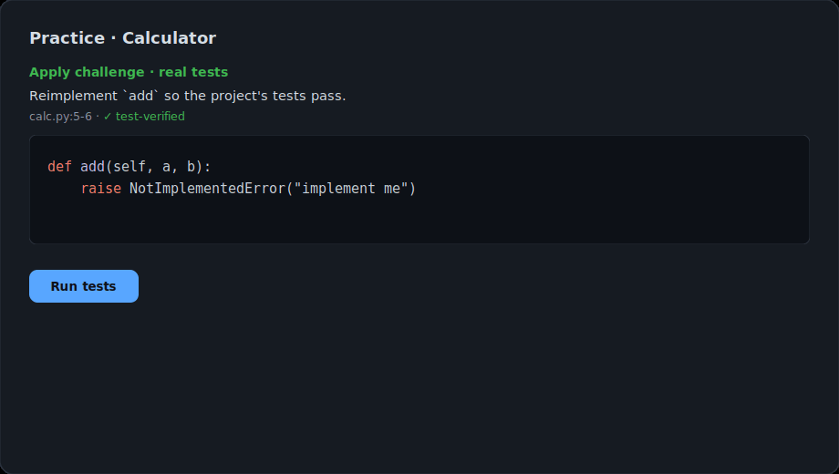
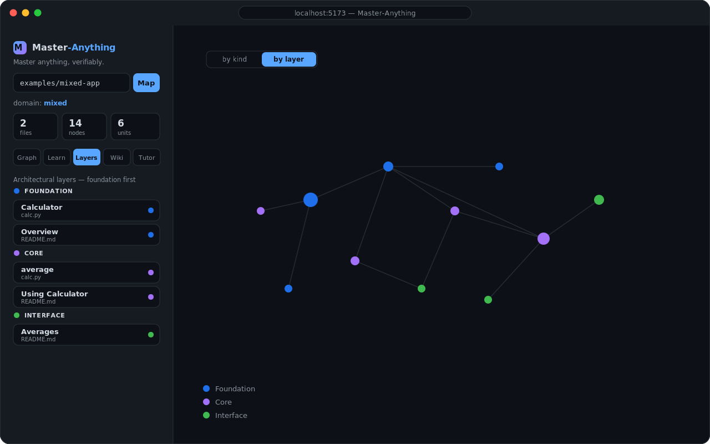
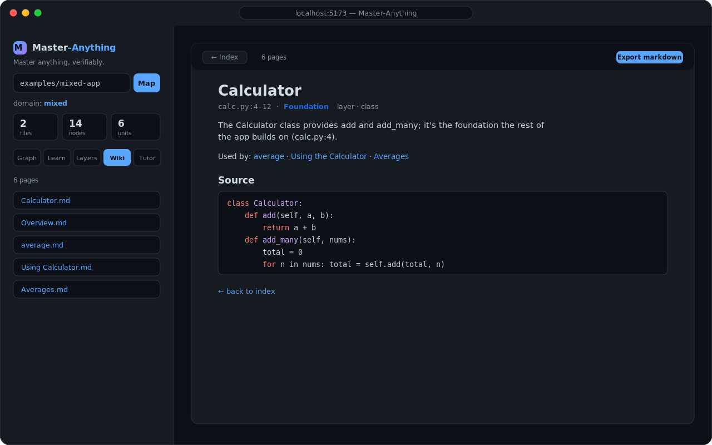

<div align="center">


# Master-Anything

### Don't just *understand* — **master it, and prove it.**

[](https://github.com/everettjf/Master-Anything/actions/workflows/ci.yml)
[](./LICENSE)
[](https://nodejs.org)
[](https://www.typescriptlang.org/)
[](https://pnpm.io)

[**Website**](https://everettjf.github.io/Master-Anything/) · [Vision](./docs/VISION.md) · [Architecture](./docs/ARCHITECTURE.md)

</div>

> ### Every other tool stops at *understand*.
> They render a pretty map — of a codebase, a doc, a paper, a PDF — and call the job done. **Master-Anything is built for what comes next —
> *mastery*.** It treats **your** skill as a living state and drives it up Bloom's **entire** ladder —
> **Understand → Apply → Analyze → Create** — with an **objective check at every rung** (real test execution and
> graph ground-truth, *never* an LLM's opinion), then keeps it sharp with **spaced repetition**.
>
> *Understanding is a one-time snapshot. **Mastery is a state you reach, prove, and retain.***

Master-Anything turns **any body of knowledge** — code first, then docs, web pages, PDFs — into an interactive
**knowledge graph**, and layers a **mastery engine** on top: a dependency-ordered learning path, quizzes, hands-on
coding challenges, and — wherever possible — **verifiable proof** that you've actually mastered each piece, using
**real tests** and **graph truth** rather than an LLM's say-so.

<div align="center">
  
  <br /><sub>The <b>Apply</b> loop — reimplement a function; the project's real tests verify your mastery.</sub>
  <br /><br />
  
  <br /><sub>The <b>Tutor</b> — grounded answers with <code>path:line</code> citations and multi-turn memory.</sub>
  <br /><br />
  
  &nbsp;
  
  <br /><sub><b>Layers</b> — architectural depth &nbsp;·&nbsp; <b>Wiki</b> — auto-generated, exportable</sub>
  <br /><br />
  <a href="https://everettjf.github.io/Master-Anything/">More on the website →</a>
</div>

---

## Why Master-Anything?

|                | Understand-style tools         | **Master-Anything**                                   |
| -------------- | ------------------------------ | ----------------------------------------------------- |
| Goal           | Read & comprehend (view-only)  | **Practice to competence** (a mastery state)          |
| Output         | A graph / dashboard            | Adaptive learning path **+ verifiable mastery**       |
| Verification   | —                              | **Real tests** (Apply) and **graph truth** (Analyze)  |
| Scope          | Usually one domain (code)      | **Anything** via pluggable adapters                   |
| Data moat      | The content graph              | The content graph **+ each learner's mastery graph**  |

The core insight: **a domain is just an input; once it's a knowledge graph, "how to make someone master it" is the
same engine.** That's why Master-Anything supports code *and* documents with one mastery engine and swappable adapters.

## Features

- 🧠 **Verifiable mastery** — the differentiator, up Bloom's ladder:
  - **Understand** — the tutor asks a question; an LLM grades your answer **against the source**.
  - **Apply** — we blank a real function; you reimplement it; the project's **actual test suite** decides if you passed
    (Python · JavaScript · TypeScript). No test covers it? Master-Anything **synthesizes a characterization test**
    (the original implementation is the oracle), so functions become verifiable even without a hand-written test
    (Python · JavaScript · TypeScript).
  - **Analyze** — "if you change `X`, what's affected?" graded against the **call/dependency graph** (objective truth).
  - **Create** — extend the codebase with a **new capability**; verified by real tests (no regression + a new passing
    test, or a hidden LLM-generated acceptance test).
- ↻ **Spaced repetition** — mastered units resurface for review on a decaying schedule; failing a review demotes a level
  (modelling forgetting), so mastery means *retained* mastery.
- 🗺️ **Knowledge graph** — deterministic structure via [Tree-sitter](https://tree-sitter.github.io/), semantics via an LLM.
- 🧩 **Anything, via adapters** — code (Python/JS/TS), Markdown, HTML, PDF; **mixed repos merge into one graph** with
  **cross-domain edges** linking docs to the code they describe.
- 💬 **Graph-grounded tutor (GraphRAG)** — answers cite `path:line`, with **multi-turn memory** and optional
  embedding retrieval.
- 🧭 **Adaptive learning path** — units ordered by dependency; mastery tracked per `(learner, unit)`. A
  **knowledge-tracing** model propagates evidence along prerequisite edges (mastering a unit is evidence its
  prerequisites are mastered too) and recommends the **next best exercise** — ready, not-yet-mastered, highest-unlock.
- 🎯 **Goal-anchored Quests** — state a goal ("fix the averaging bug"); Master-Anything anchors it to a target unit,
  has you master **exactly** the required sub-graph (target + transitive prerequisites, nothing else), and ends in a
  real Apply on the target — the passing change is the final, objective verification.
- 🛡️ **Behavioral Firewall** — the same oracle, pointed at AI edits. **Snapshot** a file's behavior (golden
  input→output for every deterministic function), let an agent rewrite it, then **verify** — proves behavior is
  preserved, or reports the exact `(function, input)` that changed and **old→new**. A regression net for *untested*
  code; CI/agent-ready CLI (`ma-firewall snapshot|verify`, non-zero exit on change). Python · JS · TS.
- 🤖 **AI certification** — the mastery loop with the learner = an **agent**. Run the Apply exam over your repo with a
  model as solver, grade it objectively (real tests / the oracle), and get a **competence profile**: pass rate + the
  units where it's weak. `POST /repos/:id/certify` with the configured model, or built-in `oracle`/`lazy` baselines.
- 🔌 **Bring any model** — 11 vendor presets via the [Vercel AI SDK](https://ai-sdk.dev) (OpenAI · Anthropic · Google ·
  OpenRouter · Groq · DeepSeek · Mistral · xAI · Together · Fireworks · Ollama) or any OpenAI-compatible endpoint.
  **Auto-detects** your key (`export ANTHROPIC_API_KEY=…` just works), supports `provider/model` shorthand and
  **failover** chains, and **runs with no key at all** (heuristic fallback). Test sandbox local or Docker.
- 💾 **Persistent & incremental** — SQLite-backed; only changed files are re-enriched; a shareable graph artifact lets
  teammates skip the pipeline.

## How it works

```
┌──────────────────────────────────────────────────────────────┐
│  Interaction   Tutor (GraphRAG) · guided path · quizzes · tasks │  generic
├──────────────────────────────────────────────────────────────┤
│  Mastery engine   decompose · knowledge-trace (Bloom) ·        │  generic ★
│                   adaptive path · assess · verify              │
├──────────────────────────────────────────────────────────────┤
│  Universal knowledge graph   nodes (concept/symbol/section) +  │  generic
│                              edges (calls/contains/documents…) │
├──────────────────────────────────────────────────────────────┤
│  Domain adapters (pluggable)                                   │  per-domain
│   📦 Code (tree-sitter)   📄 Markdown/HTML   📑 PDF             │
└──────────────────────────────────────────────────────────────┘
```

The top three layers are **domain-agnostic** — adding a domain means writing one adapter. See
[`docs/ARCHITECTURE.md`](./docs/ARCHITECTURE.md) and [`docs/VISION.md`](./docs/VISION.md).

## Quick start

**Prerequisites:** Node ≥ 22, [pnpm](https://pnpm.io), `git`. For Python Apply tasks: `python3` + `pytest`.

```bash
pnpm install
python3 -m pip install pytest        # only needed for Python Apply tasks

# start the API (http://localhost:8787) and the web app (http://localhost:5173)
pnpm --filter @ma/server dev
pnpm --filter @ma/web dev
```

Open **http://localhost:5173** and enter an **absolute repo path**. To see the full loop immediately, use a bundled
example, e.g. `…/Master-Anything/examples/py-calc` (verifiable Apply) or `…/examples/mixed-app` (code + docs with
cross-domain edges).

### The mastery loop

1. **Graph** — explore the knowledge graph; click a node to view its source (provenance-linked).
2. **Learn** — an adaptive **Next up** panel recommends your best next exercise, and a 🎯 **Quest** box turns a goal
   into a curriculum over exactly the sub-graph it needs. Open a unit to practice:
   - **Understand** — answer a question; the LLM grades it against the source.
   - **Apply** — reimplement a blanked function; the **real test suite** (or a synthesized oracle) verifies it.
   - **Analyze** — pick which units a change would affect; graded against the **graph**.
   - **Create** — add a new capability (+ a test that proves it); real tests enforce no regression.
3. **🛡 Firewall** — snapshot a file's behavior and verify an AI edit preserved it; certify a model on your repo.
4. **Tutor** — ask in natural language; answers are grounded in the graph and cite `path:line`, with multi-turn memory.

| Domain                | Adapter           | Unit        | Verifiable levels                                   |
| --------------------- | ----------------- | ----------- | --------------------------------------------------- |
| Code — Python         | Tree-sitter       | fn / class  | Understand · **Apply (pytest)** · **Analyze (graph)** |
| Code — JavaScript     | Tree-sitter       | fn / class  | Understand · **Apply (node --test)** · **Analyze**  |
| Code — TypeScript     | Tree-sitter       | fn / class  | Understand · **Apply (node type-strip)** · **Analyze** |
| Docs — Markdown       | heading sections  | section     | Understand · **Analyze (graph)**                    |
| Docs — HTML           | `<h1..6>` sections| section     | Understand · **Analyze (graph)**                    |
| Docs — PDF            | per page (unpdf)  | page        | Understand · **Analyze (graph)**                    |

> In a **mixed repo**, all of the above merge into one graph and gain `documents` edges (a doc section → the code it
> describes), so Analyze can answer *"change `Calculator` → which docs are affected?"* and the tutor cites code + docs together.

### Behavioral Firewall (standalone — `npx ma-firewall`)

Pin a file's behavior, let an AI rewrite it, then prove it didn't change — no test suite required. Shipped as a
**zero-dependency, single-file CLI** ([`ma-firewall`](./packages/firewall), `npx`-able), with non-zero exit on a
change so it drops into CI or an agent loop:

```bash
npx ma-firewall snapshot src/utils.py -o utils.behavior.json
# …an agent (or you) edits src/utils.py…
npx ma-firewall verify   src/utils.py utils.behavior.json
# ✅ behavior preserved — 19/19   |   ❌ clamp(12, -1, 7)  was 7  now 8
```

For functions whose arguments the built-in fuzzer can't construct (a config dict, a nested order, a domain
object), add `--entry` to **capture real I/O** from a script your repo already ships — it instruments the file,
runs the driver, and pins the actual input→output it observes:

```bash
npx ma-firewall snapshot src/pricing.py --entry examples/demo.py -o pricing.behavior.json
```

Within this repo (before publish), build the bundle and run it directly:

```bash
pnpm --filter ma-firewall build
node packages/firewall/dist/ma-firewall.mjs snapshot src/utils.py -o utils.behavior.json
```

Drop it into CI to fail the build on behavior drift — see [`.github/workflows/firewall.yml`](./.github/workflows/firewall.yml).

## Configuration

All optional — without any of these, Master-Anything runs with heuristic summaries, lexical retrieval, and a local
test runner. Copy [`.env.example`](./.env.example) to `.env` or export in your shell.

| Area          | Variables                                                              | Notes                                                                 |
| ------------- | --------------------------------------------------------------------- | --------------------------------------------------------------------- |
| LLM           | `MA_LLM_PROVIDER` (`openai`/`anthropic`/`google`), `MA_LLM_MODEL`, `MA_LLM_API_KEY` | Enables semantic enrichment, the tutor, and Understand grading. |
| LLM (gateway) | `MA_LLM_BASE_URL`, `MA_LLM_MODEL`                                      | Any OpenAI-compatible endpoint (OpenRouter, LiteLLM proxy, Ollama).   |
| Embeddings    | `MA_EMBED_PROVIDER`, `MA_EMBED_MODEL`, `MA_EMBED_BASE_URL`             | Semantic tutor retrieval; falls back to lexical.                      |
| Test sandbox  | `MA_SANDBOX=docker`, `MA_SANDBOX_IMAGE`                                | Isolated test runs; falls back to a local subprocess.                 |
| Persistence   | `MA_DB`, `MA_DATA_DIR`                                                 | SQLite location (mastery, graph artifacts, conversations).            |

## Understanding features

Beyond the mastery loop, Master-Anything also helps you *navigate* a codebase:

- **Architectural layers** — units ranked by dependency depth (Foundation → Interface); color the graph by layer or browse the Layers tab.
- **Guided tours** — a narrated, dependency-ordered walkthrough ("what is this, why it matters, what it connects to").
- **Auto-generated wiki** — a Karpathy-style, cross-linked markdown wiki (one page per unit, grouped by layer), viewable in-app and **exportable to commit into the repo**.

## CLI

```bash
# knowledge-graph JSON for any directory
pnpm --filter @ma/core graph <absolute-path> --out artifacts/graph.json

# generate a cross-linked markdown wiki (writes <repo>/.master-anything/wiki/)
pnpm --filter @ma/core wiki <absolute-path>
```

## Project structure

```
packages/
  core/       # graph build (tree-sitter), adapters (docs/pdf), merge + cross-link,
              # units & path, mastery engine, tutor (GraphRAG), embeddings, LLM providers
  verifier/   # break-and-fix + characterization oracle + pluggable test runners (pytest / node / docker)
  firewall/   # ma-firewall — the Behavioral Firewall as a standalone, zero-dep npx CLI
  server/     # Hono API + SQLite persistence
  web/        # React + Vite UI (graph, learn, tutor)
examples/     # py-calc · js-calc · ts-calc · md-guide · html-guide · pdf-guide · mixed-app
docs/         # VISION · ARCHITECTURE · P0-CODE-MVP (design docs)
pages/        # GitHub Pages landing site
```

## Roadmap

**Done:** verifiable Apply (Py/JS/TS) · **universal verification** via synthesized characterization tests (oracle =
the original code; Py/JS/TS) · **graph-propagating knowledge tracing** + adaptive next-exercise recommender ·
**goal-anchored Quests** (master exactly the sub-graph a goal needs, capstone-verified) ·
graph-verified Analyze · **Create-level** (extend + verify with real tests) ·
spaced-repetition reviews (with forgetting) · GraphRAG tutor with persistent multi-turn memory ·
Markdown/HTML/PDF adapters · mixed-repo unified graph with cross-domain edges · architectural layers · guided tours ·
auto-generated cross-linked wiki · embeddings retrieval · incremental re-enrichment · SQLite persistence ·
Docker sandbox runner (with local fallback).

**A→B→C arc — all shipped:** **A** ✅ universal verification — characterization spans Py/JS/TS, now with
**captured-run I/O** (instrument the target, run the repo's own example, pin *real* boundary I/O — so
functions taking a dict/object the fuzzer can't build become verifiable; `--entry` on the firewall too) ·
**B** ✅ graph-propagating **knowledge tracing** — beliefs propagate along prerequisite
edges and drive an adaptive "Next up" recommender (`GET /repos/:id/next`) · **C** ✅ goal-anchored **Quests** — state a
goal; the system masters *exactly* the required sub-graph and ends in a real Apply on the target as final verification.

**Planned:** Postgres backend for scale · real Docker-sandbox validation · more formats (slides, notebooks).

## Documentation

- [Vision](./docs/VISION.md) — positioning, principles, the "Anything" roadmap
- [Architecture](./docs/ARCHITECTURE.md) — layers, adapters, the mastery engine
- [P0 design](./docs/P0-CODE-MVP.md) — the code-mastery MVP in detail
- [Case study: captured-run I/O on `pytoolz/toolz`](./docs/casestudy/captured-run-toolz/README.md) — real-library
  numbers for verifying dict/structure-shaped functions the fuzzer can't reach
- Blog: [Getting started](./docs/blog/getting-started-with-master-anything.md)
  ([中文](./docs/blog/getting-started-with-master-anything.zh.md)) — a usage walkthrough

## Contributing

Contributions are welcome. The whole codebase is TypeScript in a pnpm workspace.

```bash
pnpm install
pnpm lint            # Biome lint + format check
pnpm -r build        # build all packages (typecheck)
pnpm test            # Vitest: pure logic + real pytest/node-test integration
```

CI (build + tests) runs on every push and PR. Please keep changes focused, match the surrounding style, and make sure
`pnpm -r build` and `pnpm test` pass before opening a PR.

## License

[MIT](./LICENSE)
